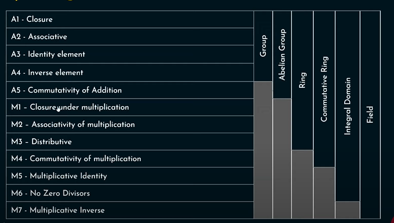

# Abstract Algebra and Number Theory

## Topics Included:

- [Division Algorithm](#division-algorithm)
- [Euclidean](#euclidean-algorithm)
- [Extended Euclidean](#euclidean-algorithm)
- [Modular Arithmetic](#modular-arithmetic)
- [Groups, Fields, Rings, Finite Fields](#abstract-math)
- Polynomial Arithmetic
- [Prime Numbers](#prime-numbers)
- [Fermat and Euler](#fermats-little-theorem)
- [Chinese Remainder](#chinese-remainder)
- [ Discrete logarithm](#discrete-log)

## Division Algorithm

## Modular Arithmetic

Congruence (&#8801;) : 20 &#8801; 8 Mod 12 in a clock

1. (a mod n + b mod n) mod n = (a+b) mod n
1. (a mod n x b mod n) mod n = (axb) mod n

etc.

<b>Modular Exponentiation </b>  
(242)^329 mod 243 &#8801; (-1)^329 mod 243 &#8801; 242 mod 243

## Prime Numbers

### Fermat's Little Theorem

### Primitive Roots

A number '&alpha;' is a primitive root modulo n if every number coprime to n is congruent to a power of '&alpha;' modulo n.
 

Eg.

- 2 a prim root of 5
- 2 mod 5 &equiv; 2
- 4 mod 5 &equiv; 4
- 8 mod 5 &equiv; 3
- 16 mod 5 &equiv; 1

All are distinct, therefore 2 is a prim root of 5.

## Euclidean Algorithm

Divisors, Common Divisors and Greatest Common Divisor

q = a/b + r with a= b and b = r, until b = 0

### Relatively Prime Numbers

If GCD(a,b) = 1

### Euler's Totient Function

&phi;(n) : number of positive integers less than n that are relatively prime to n

Eg. &phi;(5) :  
n = 5 => 1,2,3,4  
GCD(1,5) = 1  
GCD(2,5) = 1  
GCD(3,5) = 1  
GCD(4,5) = 1  
therefore &phi;(5) = 4  

Formulae:  
n prime => &phi;(n)=n-1  
n = pxq and p,q are prime => &phi;(n)=(p-1)x(q-1)  
p and q are composite => &phi;(n)=n x (1-1/p1)x(1-1/p2)x....

### Euler's Theorem

if a and n are relatively prime, then a^&phi;(n) &equiv; 1 mod n

## Multiplicative Inverse

$A^{-1}$ x A = 1 mod n  
MI of 2 (mod 5) is 3, MI of 2 (mod 7) is 4.

### Extended Euclidean

$T_{1} - T_{2} = T$ where initially $T_{1} = 0 , T_{2} = 1$

3 mod 5 -> 2

## Chinese Remainder

X = a1modm1, X = a2modm2.... X = anmodmn  
gcd(m1,m2,..mn) = 1 

X = (a1M1M1-1 + a)mod M

X = 2 (mod 3), X = 3(mod 5), X = 2(mod 7)
X = ()

M = m1\*m2\*m3 = 105  
M1 = M/m1 ...  
M1 = 35, M2 = 21, M3 = 15  
Inverses: 2, 1, 1  

X = (2x35x2 + 3x21x1 + 2x15x1)mod 105  
X = 23  

## Discrete Log

$g^{x} mod p = $ Easy to find  
$g^{?} mod p = x $ Hard to find  

One way function  

$log_{g}X$ = n mod p  
X = $g^n$ mod p 

## Abstract Math

### Groups and Abelian Group 

G -> {G,&dot;}, is a set under some operation (&dot;) if it satisfies the CAIN Properties.

Closure, Associative, Identity and Inverse.

If a group follows commutative property, it becomes an Abelian Group.

### Cyclic Group

If it contains atleast one generator element.

A generator element generates all the elements of a group when used with the operator.

For example, $w$ and $w^2$ in G = {$1,w,w^{2}$} on Group $(G,*)$

### Rings

${R, +, *}$ has two binary operations obeying following axioms-

- Group(A1-A4), Abelian Group(A5)
- Closure under multiplication(M1)
- Associative under multiplication(M2)
- Distributive Law (M3)

#### Commutative Rings

Ring is said to be commutative, if it satisfies Commutativity of multiplication: ab = ba for all a,b belonging to R.

#### Integral Domain

A Commutative Ring that follows Multiplicative Identity(M5) and No zero divisor(M6) [ab = 0 => a or b = 0] axiom

### Fields

${F, +, *}$ having a set of elements with 2 binary operators such that all a,b,c belonging to F obey:

- A1 to M6 followed => Integral Domain
- Multiplicative Inverse (M7)

#### Finite Fields

Finite field or Galois field is a field that contains finite number of elements.

Most common examples are given by integers (mod p) when p is a prime number.
