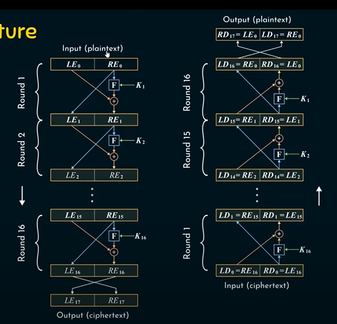

## Classical Encryption

Caesar, Monoalphabetic, Playfair, Hill and Vernam Ciphers.

We can brute force a caesar cipher by attempting all possible keys and then checking the resulted value's occurance in a language dictionary to find out the most probable key.

One Time Pad

Pseudorandom Number Generator

Key -> Generator -> Key Stream
[Linear Congruential Generator](https://en.wikipedia.org/wiki/Linear_congruential_generator)  
$\displaystyle X_{n+1}=\left(aX_{n}+c\right){\bmod {m}}$

where X is the sequence, m the modulo, a the multiplier, c the increment and X0 the seed.

Feistel Structure

